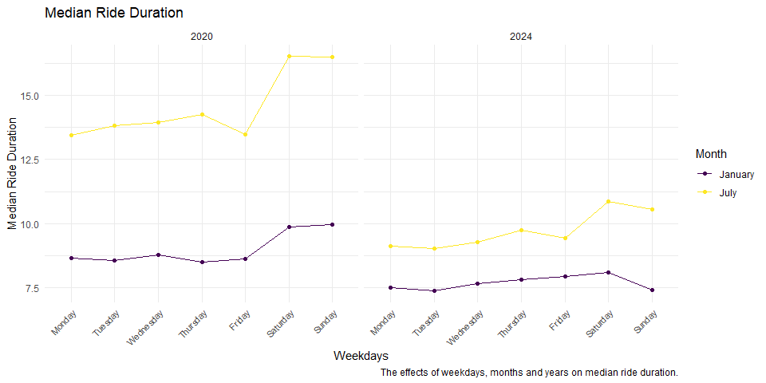
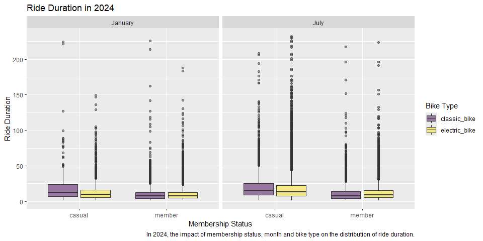

p8105_hw3_jz3902
================
Jinghan Zhao
2024-10-11

## Problem 1

### Short description

``` r
library(p8105.datasets)
data("ny_noaa")

ny_noaa
```

    ## # A tibble: 2,595,176 × 7
    ##    id          date        prcp  snow  snwd tmax  tmin 
    ##    <chr>       <date>     <int> <int> <int> <chr> <chr>
    ##  1 US1NYAB0001 2007-11-01    NA    NA    NA <NA>  <NA> 
    ##  2 US1NYAB0001 2007-11-02    NA    NA    NA <NA>  <NA> 
    ##  3 US1NYAB0001 2007-11-03    NA    NA    NA <NA>  <NA> 
    ##  4 US1NYAB0001 2007-11-04    NA    NA    NA <NA>  <NA> 
    ##  5 US1NYAB0001 2007-11-05    NA    NA    NA <NA>  <NA> 
    ##  6 US1NYAB0001 2007-11-06    NA    NA    NA <NA>  <NA> 
    ##  7 US1NYAB0001 2007-11-07    NA    NA    NA <NA>  <NA> 
    ##  8 US1NYAB0001 2007-11-08    NA    NA    NA <NA>  <NA> 
    ##  9 US1NYAB0001 2007-11-09    NA    NA    NA <NA>  <NA> 
    ## 10 US1NYAB0001 2007-11-10    NA    NA    NA <NA>  <NA> 
    ## # ℹ 2,595,166 more rows

There are 2595176 rows and 7 columns in the dataset.

``` r
colMeans(is.na(ny_noaa))
```

    ##        id      date      prcp      snow      snwd      tmax      tmin 
    ## 0.0000000 0.0000000 0.0561958 0.1468960 0.2280331 0.4371025 0.4371264

We have missing values in `prcp`, `snow`, `snwd`, `tmax` and `tmin`
columns. Especially, there over 40% data is missing in `tmax` and
`tmin`, which is a rather huge proportion.

This issue may result in a large amount of observations being ignored
during data analysis, making the analysis results incomplete and unable
to reflect the true situation.

### Data cleaning

``` r
ny_noaa_clean = 
  ny_noaa %>% 
  mutate(
    tmax = as.numeric(tmax),
    tmin = as.numeric(tmin),
    year = lubridate::year(date),
    month = lubridate::month(date),
    day = lubridate::day(date),
    prcp = prcp / 10,
    tmax = tmax / 10,
    tmin = tmin / 10
  ) %>% 
  relocate(id, date, year, month, day)

ny_noaa_clean %>% 
  count(snow) %>% 
  arrange(desc(n)) %>% 
  head()
```

    ## # A tibble: 6 × 2
    ##    snow       n
    ##   <int>   <int>
    ## 1     0 2008508
    ## 2    NA  381221
    ## 3    25   31022
    ## 4    13   23095
    ## 5    51   18274
    ## 6    76   10173

1)  Data cleaning steps:

- Create variables: `year`, `month` and `day`

- Arrange the units of variables: `prcp`(mm), `snow`(mm), `snwd`(mm),
  `tmax`(degrees C), `tmin`(degrees C)

- Organize variables in a meaningful order

2)  For snowfall, the most commonly observed values is 0. Because the
    dataset covers the whole year, but snow usually occurs in winter,
    most observations do not have snow.

### Average tmax in Jan and Jul

``` r
month.labs = c("January", "July")
names(month.labs) = c(1, 7)

ny_noaa_clean %>% 
  filter(month %in% c(1, 7)) %>%
  group_by(id, year, month) %>% 
  summarize(avg_tmax = mean(tmax, na.rm = TRUE)) %>% 
  drop_na(avg_tmax) %>% 
  ggplot(aes(x = year, y = avg_tmax, color = id)) +
  geom_point() +
  geom_line() +
  facet_grid(. ~ month, 
             labeller = labeller(month = month.labs)) +
  labs(
    title = "Average Maximum Temperature in Each Station",
    x = "Year",
    y = "Average Max Temp (°C)",
    caption = "The average max temperature in January and in July in each station across years.") +
  theme(legend.position = "none")
```


- Most of the time, the average maximum temperatures at different
  stations have similar trends: they rise or fall at the same time.

- According to the graph, outliers occurred in July between 1985-1990.
  To find out which years they are:

``` r
ny_noaa_clean %>% 
  filter(month == 7) %>%
  group_by(id, year, month) %>% 
  summarize(avg_tmax = mean(tmax, na.rm = TRUE)) %>% 
  drop_na(avg_tmax) %>% 
  arrange(avg_tmax) %>% 
  head()
```

    ## # A tibble: 6 × 4
    ## # Groups:   id, year [6]
    ##   id           year month avg_tmax
    ##   <chr>       <dbl> <dbl>    <dbl>
    ## 1 USC00308962  1988     7     14.0
    ## 2 USC00302454  2004     7     18.3
    ## 3 USC00308946  1984     7     19.1
    ## 4 USC00309389  2007     7     19.2
    ## 5 USC00306957  2000     7     19.8
    ## 6 USC00308248  2000     7     19.9

- Station USC00308962 have extreme low average temperatures (14.0
  degrees C) in January, 1988.

### tmax vs tmin + snowfall

``` r
hex_tmax_tmin = 
  ny_noaa_clean %>% 
  drop_na(tmin, tmax) %>% 
  ggplot(aes(x = tmin, y = tmax)) +
  geom_hex() +
  labs(
    title = "Hexbin Plot: tmax vs tmin",
    x = "Minimum Temperature (°C)",
    y = "Maximum Temperature (°C)") +
  theme(legend.position = "bottom",
        legend.text = element_text(size = 8, angle = 45))
  

box_snowfall = 
  ny_noaa_clean %>% 
  select(year, snow) %>% 
  filter(snow > 0 & snow < 100) %>% 
  ggplot(aes(x = factor(year), y = snow)) +
  geom_boxplot(fill = "lightblue") +
  labs(title = "Distribution of Snowfall (between 0-100 mm)",
       x = "Year",
       y = "Snowfall (mm)") +
  theme(axis.text.x = element_text(size = 8,
                                   angle = 45, 
                                   hjust = 1))

hex_tmax_tmin + box_snowfall
```


## Problem 2

### Organizing datasets

``` r
covar_df = 
  read_csv("HW3_data/nhanes_covar.csv", skip = 4) %>% 
  janitor::clean_names()

accel_df = 
  read_csv("HW3_data/nhanes_accel.csv") %>% 
  janitor::clean_names() %>% 
  pivot_longer(
    cols = min1:min1440,
    names_to = "minute",
    values_to = "mims",
    names_prefix = "min"
  )

mims_df = 
  left_join(covar_df, accel_df, by = "seqn") %>% 
  filter(age >= 21) %>% 
  drop_na(sex, age, bmi, education) %>% 
  mutate(sex = factor(sex, 
                      levels = c(1, 2),
                      labels = c("male", "female"),
                      ordered = FALSE
                      ),
         education = factor(education,
                            levels = c(1, 2, 3),
                            labels = c("Less than high school",
                                       "High school equivalent",
                                       "More than high school"),
                            ordered = TRUE
                            )
         )
```

Steps:

- Import the dataset, omit non-data entries

- Pivot `accel_df` longer

- Combine the two datasets, exclude participants: (i) less than 21 years
  of age; (ii) those with missing demographic data

- Convert numeric variable `sex` and `education` to reasonable factor
  classes (`sex` is not ordered and `education` is ordered)

### Sex-related distributions

``` r
mims_df %>% 
  select(sex, education) %>% 
  group_by(sex, education) %>% 
  summarize(n_obs = n()) %>% 
  pivot_wider(
    names_from = education,
    values_from = n_obs
  ) %>% 
  knitr::kable()
```

| sex    | Less than high school | High school equivalent | More than high school |
|:-------|----------------------:|-----------------------:|----------------------:|
| male   |                 38880 |                  50400 |                 80640 |
| female |                 40320 |                  33120 |                 84960 |

- For the “less than high school” and “more than high school”
  categories, the numbers of male and female participants are similar.

- For the “high school equivalent” category, the number of male
  participants is significantly greater than that of female
  participants, approximately 1.5 times as many.

``` r
mims_df %>% 
  select(sex, education, age) %>% 
  group_by(sex, education) %>% 
  ggplot(aes(x = education, y = age, fill = sex)) +
  geom_boxplot(alpha = .5) +
  labs(
    title = "Age Distribution",
    x = "Education Category",
    y = "Age",
    fill = "Sex",
    caption = "The age distributions for men and women in each education category.")
```


- For the “less than high school” and “more than high school”
  categories, the median age and middle 50% range are similar for male
  and female participants.

- For the “high school equivalent” category, the middle 50% age range
  for male participants is smaller than female participants. The main
  age groups of male and female participants are different, which may
  affect the comparability of data between different genders.

### Total activity vs age

``` r
mims_df %>% 
  group_by(seqn, age, sex, education) %>% 
  summarize(total_activ = sum(mims)) %>% 
  ggplot(aes(x = age, y = total_activ, color = sex)) +
  geom_point() +
  facet_grid(. ~education) +
  geom_smooth(se = FALSE) +
  labs(
    title = "Total Accelerometer Activity vs Age",
    x = "Age",
    y = "Total Activity",
    color = "Sex",
    caption = "The total accelerometer activities over the day across different ages, comparing between genders and education levels.") 
```


- Overall trend: with increasing age, total accelerometer activities
  throughout the day decreases.

- The total activities in the “more than high school” category are more
  evenly distributed across different ages.

- For different educational levels, the downward trend is more obvious
  for those with “less than high school” and more gradual for those with
  “more than high school”.

- For different genders, the overall trend is similar. In “high school
  equivalent” category, the difference between male and female
  participants is significant, and the data fluctuates. Combined with
  the previous tables and plots, this result requires further analysis
  due to the differences in the number and age distribution of
  participants.

### 24-hour activity

``` r
mims_df %>% 
  mutate(
    minute = as.numeric(minute),
    hour = minute %/% 60
    ) %>% 
  group_by(seqn, hour, sex, education) %>% 
  summarize(hour_activ = sum(mims)) %>% 
  ggplot(aes(x = hour, y = hour_activ, color = sex)) +
  geom_point(alpha = .5) +
  facet_grid(. ~education) +
  geom_smooth(se = FALSE) +
  labs(
    title = "24-hour Accelerometer Activity",
    x = "Hour",
    y = "Hour Activity",
    color = "Sex",
    caption = "The 24-hour accelerometer activities for men and women in each education category.")
```


- Overall trend: starting from midnight, the accelerometer data is low
  during the midnight; it starts to rise around 5 am and reaches the
  maximum value of the day around 10 am; then it starts to decline
  slowly until it starts to decline rapidly around 8 pm.

- For “less than high school” category, accelerometer activities for
  male and female are similar.

- For “high school equivalent” category, accelerometer activities for
  male and female are slightly different: the maximum value of the day
  is slightly larger for female participants.

- For “more than high school” category, female participants’
  accelerometer activity remain relatively balanced during the day
  (rather than gradually decreasing) and has slightly larger values than
  male participants. Besides, there are a few outliers with extremely
  high activity values in this category (hour accelerometer activity \>
  2500), which are not observed in other two categories.

## Problem 3

### Organizing dataset

``` r
jan_2020_citi = 
  read_csv("HW3_data/Jan 2020 Citi.csv") %>% 
  mutate(
    year = "2020",
    month = "January"
  ) %>% 
  relocate(ride_id, year, month)

jul_2020_citi = 
  read_csv("HW3_data/July 2020 Citi.csv") %>% 
  mutate(
    year = "2020",
    month = "July"
  ) %>% 
  relocate(ride_id, year, month)

jan_2024_citi = 
  read_csv("HW3_data/Jan 2024 Citi.csv") %>% 
  mutate(
    year = "2024",
    month = "January"
  ) %>% 
  relocate(ride_id, year, month)

jul_2024_citi = 
  read_csv("HW3_data/July 2024 Citi.csv") %>% 
  mutate(
    year = "2024",
    month = "July"
  ) %>% 
  relocate(ride_id, year, month)

result_citi = 
  jan_2020_citi %>% 
  bind_rows(jul_2020_citi) %>% 
  bind_rows(jan_2024_citi) %>% 
  bind_rows(jul_2024_citi) %>% 
  mutate(
    weekdays = factor(weekdays,
                      levels = c("Monday", "Tuesday", "Wednesday",
                      "Thursday", "Friday", "Saturday", "Sunday")
                      )
  )
```

1)  Steps

- Create new variables `year` and `month` for recognition, preparing for
  dataset combining

- Combine datasets one by one

- Convert `weekdays` variable from character to factor for further
  plotting

``` r
result_citi
```

    ## # A tibble: 99,485 × 9
    ##    ride_id        year  month rideable_type weekdays duration start_station_name
    ##    <chr>          <chr> <chr> <chr>         <fct>       <dbl> <chr>             
    ##  1 4BE06CB33B037… 2020  Janu… classic_bike  Tuesday     15.3  Columbus Ave & W …
    ##  2 26886E0349744… 2020  Janu… classic_bike  Wednesd…     5.31 2 Ave & E 96 St   
    ##  3 24DC56060EBE6… 2020  Janu… classic_bike  Friday       9.69 Columbia St & Riv…
    ##  4 EEDC1053582D0… 2020  Janu… classic_bike  Sunday       7.00 W 84 St & Columbu…
    ##  5 2CD4BD4CEE2E5… 2020  Janu… classic_bike  Friday       2.85 Forsyth St & Broo…
    ##  6 E18682F9A4E50… 2020  Janu… classic_bike  Sunday      25.5  Allen St & Hester…
    ##  7 B9B2E8960A71A… 2020  Janu… classic_bike  Sunday       3.65 Lafayette St & Je…
    ##  8 DEF8F50495E64… 2020  Janu… classic_bike  Sunday      38.3  28 Ave & 44 St    
    ##  9 17D44DA993F32… 2020  Janu… classic_bike  Thursday    38.5  Barrow St & Hudso…
    ## 10 0FD113A309327… 2020  Janu… classic_bike  Tuesday      6.52 Carlton Ave & Par…
    ## # ℹ 99,475 more rows
    ## # ℹ 2 more variables: end_station_name <chr>, member_casual <chr>

2)  Description

- The resulting dataset contains 99485 rows and 9 columns.

- Variables include ride id, year, month, bike type, day of the week,
  ride duration, name of start station, name of end station and
  membership status.

### Total number of rides

``` r
result_citi %>% 
  group_by(year, month, member_casual) %>% 
  summarize(n_obs = n()) %>% 
  pivot_wider(
    names_from = member_casual,
    values_from = n_obs
  ) %>% 
  knitr::kable()
```

| year | month   | casual | member |
|:-----|:--------|-------:|-------:|
| 2020 | January |    984 |  11436 |
| 2020 | July    |   5637 |  15411 |
| 2024 | January |   2108 |  16753 |
| 2024 | July    |  10894 |  36262 |

- For each combination of year and month, members ride more than casual
  riders.

- There are more rides in July than in January in the same year; the
  total number of rides in 2024 is more than 2020.

### Popular starting stations for July 2024

``` r
result_citi %>% 
  filter(year == "2024",
         month == "July") %>% 
  group_by(start_station_name) %>% 
  summarize(n_rides = n()) %>% 
  arrange(desc(n_rides)) %>% 
  head(n = 5) %>% 
  knitr::kable()
```

| start_station_name       | n_rides |
|:-------------------------|--------:|
| Pier 61 at Chelsea Piers |     163 |
| University Pl & E 14 St  |     155 |
| W 21 St & 6 Ave          |     152 |
| West St & Chambers St    |     150 |
| W 31 St & 7 Ave          |     146 |

### Median ride duration

``` r
result_citi %>%
  group_by(weekdays, month, year) %>% 
  summarize(median_duration = median(duration)) %>% 
  ggplot(aes(x = weekdays, 
             y = median_duration, 
             color = month,
             group = month)) +
  geom_point() +
  geom_line() +
  facet_grid(. ~year) +
  labs(
    title = "Median Ride Duration vs Weekdays",
    x = "Weekdays",
    y = "Median Ride Duration",
    color = "Month",
    caption = "The effects of weekdays on median ride duration, comparing between different months and years.") +
  theme_minimal() +
  theme(axis.text.x = element_text(size = 8,
                                   angle = 45, 
                                   hjust = 1))
```



- Comparison of day of the week: median ride duration remains relatively
  stable during the weekdays. From Friday to Saturday, ride duration
  increases.

- Comparison of month: median ride duration in July is significantly
  higher than January. In 2020, the difference between the two months is
  greater.

- Comparison of year: median ride duration in 2020 is higher than 2024.

### Ride duration in 2024

``` r
result_citi %>%
  filter(year == 2024) %>% 
  ggplot(aes(x = member_casual, 
             y = duration, 
             fill = rideable_type)) +
  geom_boxplot(alpha = .5) +
  facet_grid(. ~month) +
  labs(
    title = "Ride Duration vs Membership Status (2024)",
    x = "Membership Status",
    y = "Ride Duration",
    fill = "Bike Type",
    caption = "In 2024, the impact of membership status on the distribution of ride duration, comparing between month and bike type.")
```



- People ride for different lengths of time. In every combination of
  month, membership status and bike type, there are many outliers for
  longer rides. 75% of riders ride for 30 minutes or less, but a small
  number of people ride for longer, even 200+ minutes.

- Comparison of day of membership status: casual riders generally ride
  longer than members.

- Comparison of bike type: casual riders spend more time on classic
  bikes; members spend similar amounts of time riding classic and
  electric bikes. There are more outliers among electric bikes.
  Considering that electric bikes are more convenient and less strenuous
  than classic bikes, it is understandable that a small number of people
  would ride for an unusually long time.

- Comparison of month: ride duration in July is slightly longer than
  that in January.
